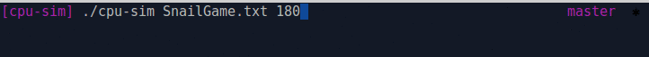

# CPU-SIM

<!-- markdown-toc start - Don't edit this section. Run M-x markdown-toc-refresh-toc -->

**Table of Contents**

- [CPU-SIM](#cpu-sim)
    - [CPU](#cpu)
    - [Memory](#memory)
    - [Timer](#timer)
    - [Interrupt processing](#interrupt-processing)
    - [Instruction Set](#instruction-set)
    - [How to build and run](#how-to-build-and-run)
    - [Save the Snail Game](#save-the-snail-game)
    - [Listing of my Files](#listing-of-my-files)

<!-- markdown-toc end -->




This is a academic project I did a while back, it simulates a simple computer
system consisting of a CPU and memory. The CPU and memory are simulated in
separate processes and use pipes to communicate.

## CPU
* supports registers: PC, SP, IR, AC, X, Y.
* supports the instructions shown below.
* runs the user program at address 0.
* Instructions are fetched into the IR from memory. The operand can be fetched
  into a local variable.
* Each instruction is executed before the next instruction is fetched.
* The user stack resides at the end of user memory and grows down toward address
  0.
* The system stack resides at the end of system memory and grows down toward
  address 0.
* There is no hardware enforcement of stack size.
* The program ends when the End instruction is executed. The 2 processes should
  end at that time.
* The user program cannot access system memory (exits with error message).

## Memory
* consists of 2000 integer entries, 0-999 for the user program, 1000-1999 for
  system code.
* supports two operations:
  * read(address) - returns the value at the address
  * write(address, data) - writes the data to the address
* Memory initializes itself by reading a program file.


## Timer

* A timer interrupts the processor after every X instructions, where X is a
command-line parameter.

## Interrupt processing

* There are two forms of interrupts: the timer and a system call using the int
  instruction.
* The stack is switched to the system stack.
* SP and PC registers is saved on the system stack. (The handler may save
  additional registers).
* A timer interrupt causes execution at address 1000.
* The int instruction causes execution at address 1500.
* Interrupts are disabled during interrupt processing to avoid nested execution.
* The iret instruction returns from an interrupt.

## Instruction Set

|  Instruction             |  Description
|--------------------------|:-------------------------------------------------------------------------
|  1 = Load value          |  Load the value into the AC
|  2 = Load addr           |  Load the value at the address into the AC
|  3 = LoadInd addr        |  Load the value from the address found in the given address into the AC
|                          |  (for example, if LoadInd 500, and 500 contains 100, then load from 100).
|  4 = LoadIdxX addr       |  Load the value at (address+X) into the AC
|                          |  (for example, if LoadIdxX 500, and X contains 10, then load from 510).
|  5 = LoadIdxY addr       |  Load the value at (address+Y) into the AC
|  6 = LoadSpX             |  Load from (Sp+X) into the AC
|  7 = Store addr          |  Store the value in the AC into the address
|  8 = Get                 |  Gets a random int from 1 to 100 into the AC
|  9 = Put port            |  If port=1, writes AC as an int to the screen
|                          |  If port=2, writes AC as a char to the screen
|  10 = AddX               |  Add the value in X to the AC
|  11 = AddY               |  Add the value in Y to the AC
|  12 = SubX               |  Subtract the value in X from the AC
|  13 = SubY               |  Subtract the value in Y from the AC
|  14 = CopyToX            |  Copy the value in the AC to X
|  15 = CopyFromX          |  Copy the value in X to the AC
|  16 = CopyToY            |  Copy the value in the AC to Y
|  17 = CopyFromY          |  Copy the value in Y to the AC
|  18 = CopyToSp           |  Copy the value in AC to the SP
|  19 = CopyFromSp         |  Copy the value in SP to the AC
|  20 = Jump addr          |  Jump to the address
|  21 = JumpIfEqual addr   |  Jump to the address only if the value in the AC is zero
|  22 = JumpIfNotEqual addr|  Jump to the address only if the value in the AC is not zero
|  23 = Call addr          |  Push return address onto stack, jump to the address
|  24 = Ret                |  Pop return address from the stack, jump to the address
|  25 = IncX               |  Increment the value in X
|  26 = DecX               |  Decrement the value in X
|  27 = Push               |  Push AC onto stack
|  28 = Pop                |  Pop from stack into AC
|  29 = Int                |  Set system mode, switch stack, push SP and PC, set new SP and PC
|  30 = IRet               |  Restore registers, set user mode
|  50 = End                |  End execution

## How to build and run

Because I'm too lazy to make a build file, do the following to build:
open a terminal and cd into the cpu-sim directory
run the following command:

```bash
find . -name '*.cpp' ! -name 'Test.cpp' | xargs g++ -o cpu-sim
```
The command will find and compile all the cpp files except the poorly hacked together unit test file, which won't compile unless you have CUTE test framework library available. 

An example of how to run the program with the snail game:
```bash
./cpu-sim snailGame.txt 150
```

Interrupt timer interval:
supports numbers on interval [1, 2147483647]

## Save the Snail Game
The snail races to a stamper, if the stamper is shut
when the snail reaches it, then the snail is going to get
squashed. The rate at which the stamper opens and slams
is controlled by how often the interrupt handler gets called.
the interrupt handler is called based on the timer parameter
that you pass to the program. So in order to win you need to
find a timer interval that allows the snail to reach the
stamper with it open.

IMPORTANT NOTE: Game animation depends on how printing a char
is implemented in the CPU simulator. The buffer needs to be
disabled or flushed each time after printing the character.

## Listing of my Files

snailGame.txt - Save the Snail Game. Please note the comments on the top of the
                source file if the game does not animate in your own CPU sim
                implementation.

Source files:
Main.cpp - contains the main function. Does some parameter checking and
           parses the program source into a string vector to pass to ComputerSim.
ComputerSim.cpp - sets up the pipes and forks. It creates the CPU or Memory objects
                  depending on if it is a parent or child. Also passes the program
                  string vector to the Memory.
Memory.cpp - initializes the memory from the string vector. Signals the CPU when
             it is ready and then listens to commands from the cpu to either read
             or write.
Cpu.cpp - fetches instructions from the memory and executes them.
